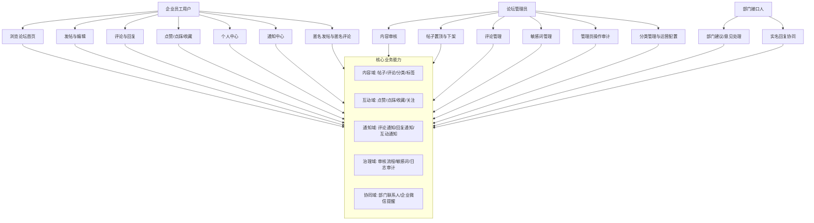

# 企业论坛系统功能架构文档

## 1. 文档信息

| 项目 | 内容 |
| --- | --- |
| 项目名称 | CUG-BBS 企业内部论坛 |
| 技术底座 | RuoYi v3.9.1 (Spring Boot + Vue2) |
| 文档类型 | 功能架构与实现架构 |
| 首次整理日期 | 2026-04-26 |
| 最后更新日期 | 2026-04-27 |
| 维护方式 | 每次迭代按本文第 8 节更新 |

---

## 2. 文档目标

本文档用于统一描述企业论坛系统的：

1. 业务功能边界与模块关系。
2. 系统实现分层与关键依赖。
3. 核心业务流程与横切能力。
4. 后续迭代更新规范，保证架构文档持续有效。

---

## 3. 业务功能架构图（汇报视角）



### 3.1 业务域说明

1. 内容域：提供帖子发布、查看、编辑、状态流转（草稿/待审/发布）和评论协作。
2. 互动域：支持点赞、点踩、收藏等行为沉淀用户活跃度。
3. 通知域：围绕评论、回复、互动行为形成消息回流，驱动二次参与。
4. 治理域：通过审核、敏感词、操作日志保障内容安全与可追溯。
5. 协同域：针对建议/意见类内容，支持部门接口人接收并处理。

---

## 4. 系统实现架构图（研发视角）

```mermaid
flowchart LR
    subgraph CLIENT[客户端层]
      FE1[Vue 页面层]
      FE2[前端路由与权限守卫]
      FE3[API 封装层]
    end

    subgraph API[接口接入层]
      C1[/bbs/post]
      C2[/bbs/comment]
      C3[/bbs/notification]
      C4[/bbs/category]
      C5[/bbs/commentManage]
      C6[/bbs/sensitive]
      C7[/bbs/deptContact]
      C8[/bbs/usercenter]
      C9[/bbs/dislike]
      C10[/bbs/BbsAdminLog]
    end

    subgraph APP[应用服务层]
      S1[BbsPostService]
      S2[BbsCommentService]
      S3[BbsNotificationService]
      S4[BbsCategoryService]
      S5[BbsSensitiveWordService]
      S6[BbsDeptContactService]
      S7[BbsDislikeService]
      S8[BbsUserCenterService]
      S9[BbsCommentManageService]
      S10[BbsAdminLogService]
    end

    subgraph DOMAIN[领域模型层]
      D1[BbsPost]
      D2[BbsComment]
      D3[BbsNotification]
      D4[BbsCategory]
      D5[BbsLike/BbsDislike]
      D6[BbsCollect/BbsFollow]
      D7[BbsSensitiveWord]
      D8[BbsDeptContact]
      D9[BbsAdminLog]
      D10[BbsTag/BbsPostTag]
    end

    subgraph PERSIST[持久化层]
      M1[MyBatis Mapper XML]
      DB[(MySQL bbsdb)]
    end

    subgraph INFRA[基础设施与横切]
      X1[Spring Security + JWT]
      X2[SysConfig + Redis]
      X3[@Log + @AdminLog]
      X4[敏感词检测]
      X5[企业微信通知]
    end

    FE1 --> FE2 --> FE3
    FE3 --> API
    API --> APP
    APP --> DOMAIN
    APP --> M1 --> DB

    FE3 -.鉴权令牌.-> X1
    API -.权限校验.-> X1
    APP -.配置读取/缓存.-> X2
    API -.操作审计.-> X3
    APP -.内容治理.-> X4
    APP -.外部消息联动.-> X5
```

---

## 5. 关键功能模块清单

### 5.1 前端模块

1. 论坛主页与发帖：[cug-bbs-ui/src/views/bbs/index.vue](../cug-bbs-ui/src/views/bbs/index.vue)
2. 帖子详情页：[cug-bbs-ui/src/views/bbs/post.vue](../cug-bbs-ui/src/views/bbs/post.vue)
3. 个人中心：[cug-bbs-ui/src/views/bbs/usercenter.vue](../cug-bbs-ui/src/views/bbs/usercenter.vue)
4. 通知中心：[cug-bbs-ui/src/views/bbs/notification.vue](../cug-bbs-ui/src/views/bbs/notification.vue)
5. 管理端页面：
   - [cug-bbs-ui/src/views/bbs/article/index.vue](../cug-bbs-ui/src/views/bbs/article/index.vue)
   - [cug-bbs-ui/src/views/bbs/comment/index.vue](../cug-bbs-ui/src/views/bbs/comment/index.vue)
   - [cug-bbs-ui/src/views/bbs/sensitive/index.vue](../cug-bbs-ui/src/views/bbs/sensitive/index.vue)
   - [cug-bbs-ui/src/views/bbs/adminLog/index.vue](../cug-bbs-ui/src/views/bbs/adminLog/index.vue)

### 5.2 后端控制器

1. 帖子控制器：[ruoyi-admin/src/main/java/com/ruoyi/web/controller/bbs/BbsPostController.java](../ruoyi-admin/src/main/java/com/ruoyi/web/controller/bbs/BbsPostController.java)
2. 评论控制器：[ruoyi-admin/src/main/java/com/ruoyi/web/controller/bbs/BbsCommentController.java](../ruoyi-admin/src/main/java/com/ruoyi/web/controller/bbs/BbsCommentController.java)
3. 通知控制器：[ruoyi-admin/src/main/java/com/ruoyi/web/controller/bbs/BbsNotificationController.java](../ruoyi-admin/src/main/java/com/ruoyi/web/controller/bbs/BbsNotificationController.java)
4. 评论管理控制器：[ruoyi-admin/src/main/java/com/ruoyi/web/controller/bbs/BbsCommentManageController.java](../ruoyi-admin/src/main/java/com/ruoyi/web/controller/bbs/BbsCommentManageController.java)
5. 敏感词控制器：[ruoyi-admin/src/main/java/com/ruoyi/web/controller/bbs/BbsSensitiveWordController.java](../ruoyi-admin/src/main/java/com/ruoyi/web/controller/bbs/BbsSensitiveWordController.java)
6. 部门接口人控制器：[ruoyi-admin/src/main/java/com/ruoyi/web/controller/bbs/BbsDeptContactController.java](../ruoyi-admin/src/main/java/com/ruoyi/web/controller/bbs/BbsDeptContactController.java)
7. 点踩控制器：[ruoyi-admin/src/main/java/com/ruoyi/web/controller/bbs/BbsDislikeController.java](../ruoyi-admin/src/main/java/com/ruoyi/web/controller/bbs/BbsDislikeController.java)

### 5.3 核心数据模型与表

1. 核心表定义：[sql/bbs_forum.sql](../sql/bbs_forum.sql)
2. 主要表：
   - bbs_post
   - bbs_comment
   - bbs_notification
   - bbs_like
   - bbs_dislike（扩展）
   - bbs_collect
   - bbs_category
   - bbs_dept_contact（扩展）
   - bbs_admin_log（扩展）

---

## 6. 关键业务流程（摘要）

### 6.1 发帖与审核流程

1. 用户发帖，先做敏感词校验。
2. 根据审核开关决定进入草稿、待审核或直接发布。
3. 发布后更新统计计数，必要时触发企业微信提醒。

### 6.2 评论与通知流程

1. 用户评论或回复后，系统写入评论并更新帖子评论数。
2. 根据评论类型（一级评论/回复）生成对应通知。
3. 通知中心支持未读统计、单条已读、全部已读。

### 6.3 互动流程（点赞/点踩/收藏）

1. 点赞、点踩、收藏均支持“再次操作即取消”。
2. 互动行为更新计数并可触发通知。
3. 评论点踩由独立接口处理，避免与点赞逻辑耦合。

---

## 7. 当前架构边界与后续演进建议

1. 目前论坛功能已经形成独立业务域，建议后续将企业微信通知抽象为统一消息网关。
2. 建议补充“统一事件模型”（如发帖事件、评论事件）以降低服务耦合。
3. 建议为审核链路补充状态机定义，明确流转规则与异常回滚策略。

### 7.1 建议补充的基础能力

从企业论坛系统建设角度，当前版本还建议继续补齐以下基础能力：

1. 举报与申诉机制：补齐帖子/评论举报、处置结论、申诉回路，形成完整治理闭环。
2. 标签与专题运营：支持帖子标签、专题页、运营合集，提升内容沉淀与复用效率。
3. 搜索与检索增强：补齐标题、正文、作者、部门、标签多维检索，以及搜索热词分析。
4. 建议闭环 SLA：对建议/意见类帖子增加受理、处理中、已解决、已反馈等状态，形成跨部门协同闭环。
5. 数据驾驶舱：沉淀发帖量、活跃用户、未回复帖子、热点话题、匿名占比等核心运营指标。
6. 风险与审计联动：把 AI 审核、敏感词命中、管理员处置记录打通，形成统一风控台账。

### 7.2 本次新增的创新功能

本次已在论坛首页与发帖页落地 3 组轻量创新能力，无需新增数据库表：

1. 论坛运营看板：在首页展示当前筛选帖子量、待回应帖子数、高热度帖子数、匿名占比。
2. 全站热议榜与话题雷达：复用热门帖子接口生成热榜，并从热门标题中抽取热词，支持一键填入 AI 助写关键词。
3. 发帖灵感胶囊与发布质量助手：为不同帖子类型提供结构模板、热点关键词推荐、内容质量评分与优化建议。

### 7.3 已实施的建议闭环能力

为落实“建议类帖子闭环处理”建议，当前版本已新增一条轻量实现路径：

1. 对建议/意见类帖子，在详情页展示“建议闭环状态”卡片。
2. 部门接口人或管理员可直接将帖子更新为“已受理、处理中、已反馈、已解决”。
3. 当前版本采用兼容方案复用 `bbs_post.auditReason` 存储闭环状态，不新增表结构，便于先上线验证业务价值。
4. 后续若闭环流程继续扩展，再升级为独立字段或独立流转表。

---

## 8. 迭代更新规范（必须执行）

每次版本迭代（需求开发、接口变化、流程变更）后，必须同步更新本文档：

1. 更新第 1 节中的“最后更新日期”。
2. 若新增/删除功能模块，更新第 3、4、5 节的架构图和模块清单。
3. 若业务流转变化，更新第 6 节流程说明。
4. 在第 9 节追加一条迭代记录。

建议触发条件：

1. 新增或删除 Controller 路径。
2. 新增数据库核心表或字段改变语义。
3. 审核、通知、权限、匿名机制规则改变。
4. 前端主路由或核心页面职责变化。

---

## 9. 迭代记录（Changelog）

| 版本/日期 | 变更类型 | 变更摘要 | 影响模块 | 更新人 |
| --- | --- | --- | --- | --- |
| v1 / 2026-04-26 | 文档初始化 | 完成企业论坛业务架构图与实现架构图，建立迭代更新规范 | 全域 | Copilot |
| v2 / 2026-04-27 | 能力增强 | 补充论坛建设建议清单，并落地首页运营看板、热议榜/话题雷达、发帖质量助手 | 论坛首页、发帖体验、架构文档 | Copilot |
| v3 / 2026-04-27 | 闭环增强 | 为建议/意见类帖子增加闭环状态展示与更新能力，支持部门接口人和管理员维护处理进度 | 帖子详情、帖子控制器、架构文档 | Copilot |

---

## 10. 迭代更新模板（复制使用）

```markdown
### [版本号/日期]
- 变更类型：功能新增 / 功能调整 / 架构重构 / 数据结构变更
- 变更摘要：
- 影响范围：前端 / 控制器 / 服务 / 数据库 / 横切能力
- 必改章节：第 X 节、第 X 节
- 关联 PR/需求：
```
